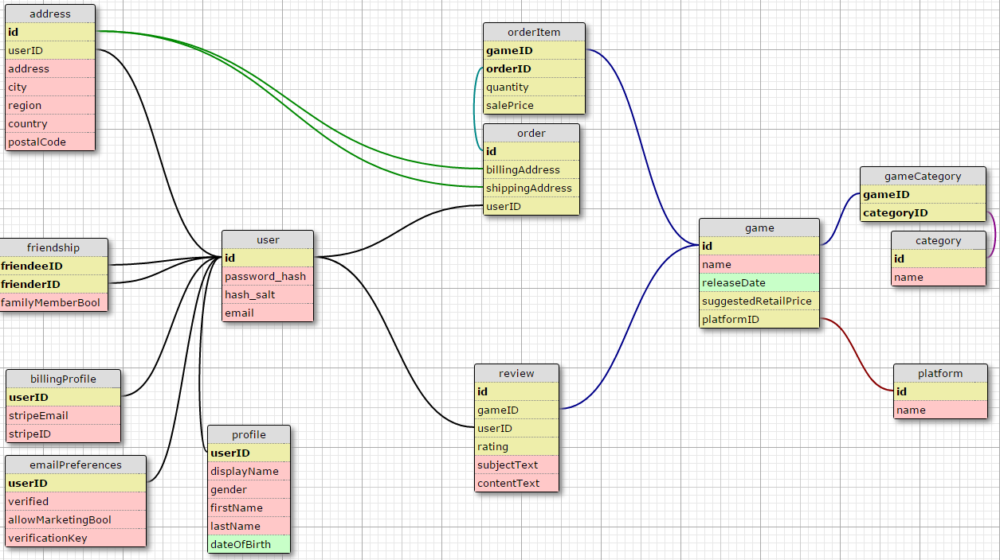

# Entities List [XML](./Entities.xml) [SQL](./Entities.sql)

## Entities
1. Address
 - Street Address
 - City
 - Province / State / Region
 - Country
 - Postal Code
2. User
 - Password
 - Email
    - Verification key (for validating)
    - Was it verified? 
    - Allows marketing?
 - Display Name
 - Gender
 - Full Name
 - Date of Birth
 - Friends
3. Credit Card
 - CVV
 - Expiration
4. Game
 - Category
 - Platform
5. Order
 - Games

## Relationships
A relational table using these entities might look something like this

This diagram was created with http://ondras.zarovi.cz/sql/demo/

You can load the [XML](./Entities.xml) into that web editor by clicking the "save / load" button
at the top right, pasting the XML into the textarea and clicking "Load XML".

You can load the version stored on their servers by instead clicking the "load" button in the 
server section and paste/type "SeaSharpe" into the dialogue box. This is probably easier and 
faster but it might not be the same version stored in this repository.
