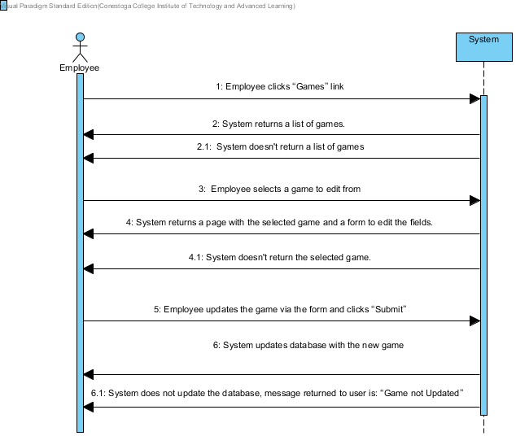

# Activity Diagrams

### Table of Contents
1. [Members / Visitors Use Case Descriptions](#members--visitors)
  1. [Sign up for account](#sign-up-for-account)
  1. [Login to site](#login-to-site)
  1. [Setup Profile](#setup-profile)
  1. [Opt In/Out of receiving promotional materials by email](#opt-inout-of-receiving-promotional-materials-by-email)
  1. [Set Platform Preference](#set-platform-preference)
  1. [Set game category preference](#set-game-category-preference)
  1. [Member registers a credit card](#member-registers-a-credit-card)
  1. [Add or Modify a shipping address](#add-or-modify-a-shipping-address)
  1. [Delete a shipping address](#delete-a-shipping-address)
  1. [Reset member password](#reset-member-password)
  1. [Search For Event](#search-for-event)
  1. [Register for an event](#register-for-an-event)
  1. [View game reviews](#view-game-reviews)
  1. [Review games](#review-games)
  1. [Rate games](#rate-games)
  1. [Add friends and family to account](#add-friends-and-family-to-account)
  1. [View another members wishlist](#view-another-members-wishlist)
  1. [Add to Wishlist](#add-to-wishlist)
  1. [Member Downloads Game](#member-downloads-game)
  1. [Member Checkout](#member-checkout)
  1. [Add game to cart](#add-game-to-cart)
  1. [Display game details](#display-game-details)
  1. [Search for games](#search-for-games)
1. [Employee Use Case Descriptions](#employees)
  1. [Add Event](#add-event)
  1. [Edit Event](#edit-event)
  1. [Delete Event](#delete-event)
  1. [Add Game](#add-game)
  1. [Edit Game](#edit-game)
  1. [Delete Game](#delete-game)
  1. [Ship Games](#ship-games)
  1. [Approve Reviews](#approve-reviews)
  1. [View Report](#view-report)
  1. [Print Reports](#print-reports)

## Members / Visitors
### Sign up for account

### Login to site

### Setup Profile

### Opt In/Out of receiving promotional materials by email

### Set Platform Preference

### Set game category preference

### Member registers a credit card

### Add or Modify a shipping address

### Delete a shipping address

### Reset member password

### Search For Event

### View game reviews

### Review games

### Rate games

### Add friends and family to account

### View another members wishlist

### Add to Wishlist

### Member Downloads Game

### Member Checkout

### Add game to cart

### Display game details

### Search for games

## Employees
### Add Event

### Edit Event

### Delete Event

### Add Game

### Edit Game

### Delete Game

### Ship Games

### Mark Order As Processed

### Approve Reviews

### View Report

