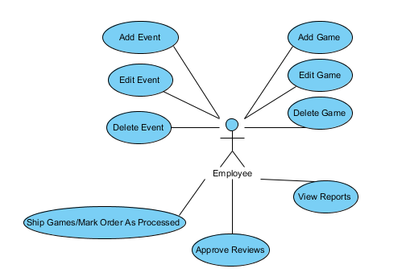

# Use Case Descriptions

### Table of Contents
1. [Diagrams](#diagrams)
1. [Users / Visitors Use Case Descriptions](#users--visitors)
  1. [Sign up for account](#sign-up-for-account)
  1. [Login to site](#login-to-site)
  1. [Setup Profile](#setup-profile)
  1. [Opt In/Out of receiving promotional materials by email](#opt-inout-of-receiving-promotional-materials-by-email)
  1. [Set Platform Preference](#set-platform-preference)
  1. [Set game category preference](#set-game-category-preference)
  1. [User registers a credit card](#user-registers-a-credit-card)
  1. [Add or Modify a shipping address](#add-or-modify-a-shipping-address)
  1. [Delete a shipping address](#delete-a-shipping-address)
  1. [Reset user password](#reset-user-password)
  1. [User/Visitor searches for an event](#uservisitor-searches-for-an-event)
  1. [Register for an event](#register-for-an-event)
  1. [View game reviews](#view-game-reviews)
  1. [Review games](#review-games)
  1. [Rate games](#rate-games)
  1. [Add friends and family to account](#add-friends-and-family-to-account)
  1. [View another users wishlist](#view-another-users-wishlist)
  1. [Add to Wishlist](#add-to-wishlist)
  1. [User Downloads Game](#user-downloads-game)
  1. [User Checkout](#user-checkout)
  1. [Add game to cart](#add-game-to-cart)
  1. [Display game details](#display-game-details)
  1. [Search for games](#search-for-games)
1. [Employee Use Case Descriptions](#employees)
  1. [Add Event](#add-event)
  1. [Edit Event](#edit-event)
  1. [Delete Event](#delete-event)
  1. [Add Game](#add-game)
  1. [Edit Game](#edit-game)
  1. [Delete Game](#delete-game)
  1. [Post Games](#post-games)
  1. [Mark Order As Processed](#mark-order-as-processed)
  1. [Approve Reviews](#approve-reviews)
  1. [View Reports](#view-reports)
  1. [Print Reports](#print-reports)

## Diagrams

## Users / Visitors

### Sign up for account
<table>
  <tr>
    <th width="20%">Use Case Name</th>
    <td colspan="2">Sign Up For Account</td>
  </tr>
  <tr>
    <th>Description</th>
    <td colspan="2">The visitor will sign up for a new account on the CVGS site</td>
  </tr>
  <tr>
    <th>Actor(s)</th>
    <td colspan="2">Visitor</td>
  </tr>
  <tr>
    <th>Preconditions</th>
    <td colspan="2">1. Visitor goes to the CVGS site.</td>
  </tr>
  <tr>
    <th rowspan="2">Basic Flow of Events</th>
    <th width="35%">Actor</th>
    <th width="35%">System</th>
  </tr>
  <tr>
    <td>
      1 Visitor clicks &ldquo;Sign Up for new Account&rdquo; 
      3 User fills out form and clicks submit
    </td>
    <td>
        2 System displays a form for the user to fill out including username, and
      unique password. 
        4 System creates an entry for the user in the database and returns a message:
      &ldquo;Account created&rdquo;.
    </td>
  </tr>
  <tr>
    <th>Alternate Flow(s)</th>
    <td colspan="2">2.1 Site is redirected to the initial sign-up page.</td>
  </tr>
  <tr>
    <th>Success Guarantee</th>
    <td colspan="2">Visitor's account is created</td>
  </tr>
  <tr>
    <th>Minimum Guarantee</th>
    <td colspan="2">Visitor can try to create the account again.</td>
  </tr>
</table>

### Login to site
<table>
  <tr>
    <th width="20%">Use Case Name</th>
    <td colspan="2">Login to site</td>
  </tr>
  <tr>
    <th>Description</th>
    <td colspan="2">User enters a valid username and password</td>
  </tr>
  <tr>
    <th>Actor(s)</th>
    <td colspan="2">User</td>
  </tr>
  <tr>
    <th>Preconditions</th>
    <td colspan="2">User must have created an account</td>
  </tr>
  <tr>
    <th rowspan="2">Basic Flow of Events</th>
    <th width="35%">Actor</th>
    <th width="35%">System</th>
  </tr>
  <tr>
    <td>
      
1. User enters a username and password

    </td>
    <td>
      
2. System returns display of main site page

    </td>
  </tr>
  <tr>
    <th>Alternate Flow(s)</th>
    <td colspan="2">2.1 System returns to the login page</td>
  </tr>
  <tr>
    <th>Success Guarantee</th>
    <td colspan="2">User will be logged into their account on their home screen.</td>
  </tr>
  <tr>
    <th>Minimum Guarantee</th>
    <td colspan="2">User will be re-prompted for username and password.</td>
  </tr>
</table>

### Setup Profile
<table>
  <tr>
    <th width="20%">Use Case Name</th>
    <td colspan="2">Setup Profile</td>
  </tr>
  <tr>
    <th>Description</th>
    <td colspan="2">User can setup their profile for their account</td>
  </tr>
  <tr>
    <th>Actor(s)</th>
    <td colspan="2">User</td>
  </tr>
  <tr>
    <th>Preconditions</th>
    <td colspan="2">Account must be active and user must be logged in.</td>
  </tr>
  <tr>
    <th rowspan="2">Basic Flow of Events</th>
    <th width="35%">Actor</th>
    <th width="35%">System</th>
  </tr>
  <tr>
    <td>
      1. User selects &ldquo;Update Profile&rdquo; 
      3. User enters in data and clicks submit.
    </td>
    <td>
      2. System redirects user to page where they can fill in their display name, actual name, email, gender, and birthdate. 
      4. System updates database and returns message: &ldquo;Profile updated successfully&rdquo;.
    </td>
  </tr>
  <tr>
    <th>Alternate Flow(s)</th>
    <td colspan="2">
      2.1 No profile page is found, user is redirected to their account default page. 
      4.1 System is unable to update the database, returns message &ldquo;Profile not updated&rdquo;
    </td>
  </tr>
  <tr>
    <th>Success Guarantee</th>
    <td colspan="2">User is able to enter their info and it is saved in their profile.</td>
  </tr>
  <tr>
    <th>Minimum Guarantee</th>
    <td colspan="2">User can try to update their profile again.</td>
  </tr>
</table>

### Opt In/Out of receiving promotional materials by email
<table>
  <tr>
    <th width="20%">Use Case Name</th>
    <td colspan="2">Opt In/Out of receiving promotional materials by email</td>
  </tr>
  <tr>
    <th>Description</th>
    <td colspan="2">User decides whether to receive promotional material via email.</td>
  </tr>
  <tr>
    <th>Actor(s)</th>
    <td colspan="2">User</td>
  </tr>
  <tr>
    <th>Preconditions</th>
    <td colspan="2">User must be logged in</td>
  </tr>
  <tr>
    <th rowspan="2">Basic Flow of Events</th>
    <th width="35%">Actor</th>
    <th width="35%">System</th>
  </tr>
  <tr>
    <td>
      1. User goes to profile, which contains checkbox to set option
    </td>
    <td>
      2. System returns a confirmation of setting change and updates database
    </td>
  </tr>
  <tr>
    <th>Alternate Flow(s)</th>
    <td colspan="2">
      2.1 State of promotional materials not changed, message that the state of promotional materials is unchanged.
    </td>
  </tr>
  <tr>
    <th>Success Guarantee</th>
    <td colspan="2">
      State of promotional materials changes, message states: &ldquo;promotional materials will (not) be sent out.
    </td>
  </tr>
  <tr>
    <th>Minimum Guarantee</th>
    <td colspan="2">
       User can try again to change the state of receiving promotional material.
    </td>
  </tr>
</table>

### Set Platform Preference
<table>
  <tr>
    <th width="20%">Use Case Name</th>
    <td colspan="2">Set Platform Preference</td>
  </tr>
  <tr>
    <th>Description</th>
    <td colspan="2">Allows the user to specify their preferred gaming platform.</td>
  </tr>
  <tr>
    <th>Actor(s)</th>
    <td colspan="2">User</td>
  </tr>
  <tr>
    <th>Preconditions</th>
    <td colspan="2">User has logged into their account, and is updating their account preferences.</td>
  </tr>
  <tr>
    <th rowspan="2">Basic Flow of Events</th>
    <th width="35%">Actor</th>
    <th width="35%">System</th>
  </tr>
  <tr>
    <td>
      1. User selects their preferred platform from a list (ie desktop PC, tablet, or mobile phone)
    </td>
    <td>
      2. System stores the selected platform and returns a success message to the user.
    </td>
  </tr>
  <tr>
    <th>Alternate Flow(s)</th>
    <td colspan="2">2.1 System does not store preferred platform, message to user &ldquo;preferred platform not saved&rdquo;</td>
  </tr>
  <tr>
    <th>Success Guarantee</th>
    <td colspan="2">System messages user: &ldquo;preferred platform saved&rdquo;</td>
  </tr>
  <tr>
    <th>Minimum Guarantee</th>
    <td colspan="2">User will get a successful or not successful message returned.</td>
  </tr>
</table>

### Set game category preference
<table>
  <tr>
    <th width="20%">Use Case Name</th>
    <td colspan="2">Set game category preference</td>
  </tr>
  <tr>
    <th>Description</th>
    <td colspan="2">User sets their preferred game category</td>
  </tr>
  <tr>
    <th>Actor(s)</th>
    <td colspan="2">User</td>
  </tr>
  <tr>
    <th>Preconditions</th>
    <td colspan="2">User is logged in to their account.</td>
  </tr>
  <tr>
    <th rowspan="2">Basic Flow of Events</th>
    <th width="35%">Actor</th>
    <th width="35%">System</th>
  </tr>
  <tr>
    <td>
      1.User clicks &ldquo;Preferences&rdquo; 
      3.User selects their preferred game category from the list and then clicks Submit
    </td>
    <td>
       2. User is taken to the &ldquo;Preferences&rdquo; page 
       4. System updated the preferred game category and saves to the database. 
       5. Return the user to the Home screen
    </td>
  </tr>
  <tr>
    <th>Alternate Flow(s)</th>
    <td colspan="2">2.1 User remains on the &ldquo;Home&rdquo; screen</td>
  </tr>
  <tr>
    <th>Success Guarantee</th>
    <td colspan="2">The preferred game category is updated for the user.</td>
  </tr>
  <tr>
    <th>Minimum Guarantee</th>
    <td colspan="2">The user is returned to the Home screen to try to update the preferred game category again.</td>
  </tr>
</table>

### User registers a credit card
<table>
  <tr>
    <th width="20%">Use Case Name</th>
    <td colspan="2">User registers a credit card</td>
  </tr>
  <tr>
    <th>Description</th>
    <td colspan="2">User adds a credit card to their account</td>
  </tr>
  <tr>
    <th>Actor(s)</th>
    <td colspan="2">User</td>
  </tr>
  <tr>
    <th>Preconditions</th>
    <td colspan="2">User is logged in to their CVGS account</td>
  </tr>
  <tr>
    <th rowspan="2">Basic Flow of Events</th>
    <th width="35%">Actor</th>
    <th width="35%">System</th>
  </tr>
  <tr>
    <td>
      1. User clicks on &ldquo;Profile&rdquo; from main page. 
      3. User selects &ldquo;Add Credit Card&rdquo; 
      5. User enters credit card data and clicks &ldquo;Submit&rdquo; 
      7. User clicks &ldquo;Confirm&rdquo;
    </td>
    <td>
      2.System returns the profile page 
      4. System returns the page form for adding a credit card.  
      6. System validates details and returns confirmation message 
      8. System adds credit card to database and returns user to the profile page where they may add other cards.
    </td>
  </tr>
  <tr>
    <th>Alternate Flow(s)</th>
    <td colspan="2">
      5.1 User enters invalid data 
      6.1 System returns the credit card page with errors highlighted
    </td>
  </tr>
  <tr>
    <th>Success Guarantee</th>
    <td colspan="2">Card is added to the users profile</td>
  </tr>
  <tr>
    <th>Minimum Guarantee</th>
    <td colspan="2">User can try to add the credit card again.</td>
  </tr>
</table>

### Add or Modify a shipping address
<table>
  <tr>
    <th width="20%">Use Case Name</th>
    <td colspan="2">Add or Modify a shipping address</td>
  </tr>
  <tr>
    <th>Description</th>
    <td colspan="2">User adds or modifies a shipping address connected to their profile</td>
  </tr>
  <tr>
    <th>Actor(s)</th>
    <td colspan="2">User</td>
  </tr>
  <tr>
    <th>Preconditions</th>
    <td colspan="2">User is logged in to a valid account</td>
  </tr>
  <tr>
    <th rowspan="2">Basic Flow of Events</th>
    <th width="35%">Actor</th>
    <th width="35%">System</th>
  </tr>
  <tr>
    <td>
      1.User clicks on &ldquo;Profile&rdquo; from main page. 
      3. User selects &ldquo;Shipping Options&rdquo;  
      5. User clicks &ldquo;Add or Update Shipping Address&rdquo; 
      7. User enters details 
      9. User clicks &ldquo;Confirm&rdquo;
    </td>
    <td>
      2. System returns the profile page 
      4. System returns the &ldquo;Shipping details&rdquo; page 
      6. System returns address entry form page 
      8. System validates information entered. Returns confirmation to user 
      10. System updates the information in the database and returns an email to the user notifying them of the change
    </td>
  </tr>
  <tr>
    <th>Alternate Flow(s)</th>
    <td colspan="2">8.1 System returns the address entry form with errors highlighted</td>
  </tr>
  <tr>
    <th>Success Guarantee</th>
    <td colspan="2">User address is added to the users profile</td>
  </tr>
  <tr>
    <th>Minimum Guarantee</th>
    <td colspan="2">User has the option of adding address to profile again.</td>
  </tr>
</table>

### Delete a shipping address
<table>
  <tr>
    <th width="20%">Use Case Name</th>
    <td colspan="2">Delete a shipping address</td>
  </tr>
  <tr>
    <th>Description</th>
    <td colspan="2">User deletes a shipping address connected to their profile </td>
  </tr>
  <tr>
    <th>Actor(s)</th>
    <td colspan="2">User</td>
  </tr>
  <tr>
    <th>Preconditions</th>
    <td colspan="2">User is logged in to their CVGS account</td>
  </tr>
  <tr>
    <th rowspan="2">Basic Flow of Events</th>
    <th width="35%">Actor</th>
    <th width="35%">System</th>
  </tr>
  <tr>
    <td>
      1. User clicks on &ldquo;Profile&rdquo; from main page. 
      3. User selects &ldquo;Shipping Options&rdquo;  
      5. User clicks &ldquo;Delete Shipping Address&rdquo; 
      7. Users confirms message box.
    </td>
    <td>
      2. System returns the profile page 
      4. System returns the &ldquo;Shipping details&rdquo; page 
      6. System returns a confirmation message 
      8. System updates database and returns email to user confirming the change
    </td>
  </tr>
  <tr>
    <th>Alternate Flow(s)</th>
    <td colspan="2">
      7.1 User clicks &ldquo;Cancel&rdquo; 
      8.1 System returns the &ldquo;Shipping Options&rdquo; page. No changes are committed to the database
    </td>
  </tr>
  <tr>
    <th>Success Guarantee</th>
    <td colspan="2">User deletes shipping address linked to profile </td>
  </tr>
  <tr>
    <th>Minimum Guarantee</th>
    <td colspan="2">User can again try to delete the shipping address from profile</td>
  </tr>
</table>

### Reset user password
<table>
  <tr>
    <th width="20%">Use Case Name</th>
    <td colspan="2">Reset user password</td>
  </tr>
  <tr>
    <th>Description</th>
    <td colspan="2">User resets their password</td>
  </tr>
  <tr>
    <th>Actor(s)</th>
    <td colspan="2">User</td>
  </tr>
  <tr>
    <th>Preconditions</th>
    <td colspan="2">User is logged in to a valid account</td>
  </tr>
  <tr>
    <th rowspan="2">Basic Flow of Events</th>
    <th width="35%">Actor</th>
    <th width="35%">System</th>
  </tr>
  <tr>
    <td>
      1. User forgets their password on login. Clicks &ldquo;Forgot Password&rdquo; 
      3. User receives email saying a password reset has been requested for the account, User clicks link within 
      5. User is asked to enter a new password. Then re-enter password to make sure user has entered their desired password. 
    </td>
    <td>
      2. Systems returns Email to the registered username of the account. 
      4. System returns a reset page. 
      6. System commits changes to user account. Returns user to login page.
    </td>
  </tr>
  <tr>
    <th>Alternate Flow(s)</th>
    <td colspan="2">
      1.1 User can also change password in preferences by clicking change password. 
      2.1 System returns a reset page. 
      3.1 User is asked to enter a new password. Then re-enter password to make sure user has entered their desired password. 
      4.1 System commits changes and returns user to preferences
    </td>
  </tr>
  <tr>
    <th>Success Guarantee</th>
    <td colspan="2">User password linked to profile is reset </td>
  </tr>
  <tr>
    <th>Minimum Guarantee</th>
    <td colspan="2">User can try to reset their password again.</td>
  </tr>
</table>

### User/Visitor searches for an event
<table>
  <tr>
    <th width="20%">Use Case Name</th>
    <td colspan="2">User/Visitor searches for an event</td>
  </tr>
  <tr>
    <th>Description</th>
    <td colspan="2">User/Visitor searches for an event through the website.</td>
  </tr>
  <tr>
    <th>Actor(s)</th>
    <td colspan="2">User/Visitor</td>
  </tr>
  <tr>
    <th>Preconditions</th>
    <td colspan="2">User is logged in to their CVGS account</td>
  </tr>
  <tr>
    <th rowspan="2">Basic Flow of Events</th>
    <th width="35%">Actor</th>
    <th width="35%">System</th>
  </tr>
  <tr>
    <td>
      1. User/Visitor clicks on the &ldquo;Events&rdquo; tab of the site 
      3. User/Visitor browses or searches through a list of events and finds an event they are interested in and clicks the event 
      5. User/Visitor reads through detail and decides to participate in event. Clicks &ldquo;Join&rdquo;
    </td>
    <td>
      2. Systems returns page of events 
      4. System returns a page of details about selected event.
    </td>
  </tr>
  <tr>
    <th>Alternate Flow(s)</th>
    <td colspan="2">
      5.1 Visitor is  not logged in and is prompted to ethier login or register an account. 
      5.2 User decides they are not interested. Clicks &ldquo;Return to Events&rdquo; 
      6.1 System returns Events list
    </td>
  </tr>
  <tr>
    <th>Success Guarantee</th>
    <td colspan="2">User/Visitor is able to search for events listed on site</td>
  </tr>
  <tr>
    <th>Minimum Guarantee</th>
    <td colspan="2">User can retry the event search</td>
  </tr>
</table>

### Register for an event
<table>
  <tr>
    <th width="20%">Use Case Name</th>
    <td colspan="2">Register for an event</td>
  </tr>
  <tr>
    <th>Description</th>
    <td colspan="2">User registers for an event through the website.</td>
  </tr>
  <tr>
    <th>Actor(s)</th>
    <td colspan="2">User</td>
  </tr>
  <tr>
    <th>Preconditions</th>
    <td colspan="2">User is logged in to their CVGS account</td>
  </tr>
  <tr>
    <th rowspan="2">Basic Flow of Events</th>
    <th width="35%">Actor</th>
    <th width="35%">System</th>
  </tr>
  <tr>
    <td>
      1. User finds an event they are interested in and clicks it. 
      3. User reads through detail and decides to participate in event. Clicks &ldquo;Join&rdquo; 
      5. User confirms the message.
    </td>
    <td>
      2. System returns a page of details about selected event. 
      4. System returns a confirmation message to the user 
      6. System adds user to a list of attendees for event and returns a message to the user that they have been registered
    </td>
  </tr>
  <tr>
    <th>Alternate Flow(s)</th>
    <td colspan="2">
      3.1 User decides they are not interested. Clicks &ldquo;Return to Events&rdquo; 
      4.1 System returns Events list
    </td>
  </tr>
  <tr>
    <th>Success Guarantee</th>
    <td colspan="2">User is able to register for events listed on site</td>
  </tr>
  <tr>
    <th>Minimum Guarantee</th>
    <td colspan="2">User can retry to register for events.</td>
  </tr>
</table>

### View game reviews
<table>
  <tr>
    <th width="20%">Use Case Name</th>
    <td colspan="2">View game reviews</td>
  </tr>
  <tr>
    <th>Description</th>
    <td colspan="2">User/Visitor views game reviews on website.</td>
  </tr>
  <tr>
    <th>Actor(s)</th>
    <td colspan="2">User/Visitor</td>
  </tr>
  <tr>
    <th>Preconditions</th>
    <td colspan="2">User/visitor is on the CVGS website. Browsing games</td>
  </tr>
  <tr>
    <th rowspan="2">Basic Flow of Events</th>
    <th width="35%">Actor</th>
    <th width="35%">System</th>
  </tr>
  <tr>
    <td>
      1. On finding a game user clicks game 
    </td>
    <td>
      2. System returns a details page for the game which contains reviews. 
    </td>
  </tr>
  <tr>
    <th>Alternate Flow(s)</th>
    <td colspan="2"></td>
  </tr>
  <tr>
    <th>Success Guarantee</th>
    <td colspan="2">User/Visitor browse reviews of game.</td>
  </tr>
  <tr>
    <th>Minimum Guarantee</th>
    <td colspan="2">User can try again browse reviews.</td>
  </tr>
</table>

### Review games
<table>
  <tr>
    <th width="20%">Use Case Name</th>
    <td colspan="2">Review games</td>
  </tr>
  <tr>
    <th>Description</th>
    <td colspan="2">User reviews a game on website.</td>
  </tr>
  <tr>
    <th>Actor(s)</th>
    <td colspan="2">User</td>
  </tr>
  <tr>
    <th>Preconditions</th>
    <td colspan="2">User is logged in to their CVGS account and viewing available games.</td>
  </tr>
  <tr>
    <th rowspan="2">Basic Flow of Events</th>
    <th width="35%">Actor</th>
    <th width="35%">System</th>
  </tr>
  <tr>
    <td>
      1. On a particular game user clicks &ldquo;Review game&rdquo;  
      3. User enters their review and clicks submit.
    </td>
    <td>
      2. System returns a form to review game.  
      4. System adds review to list of reviews for the game along with the username of the user who wrote the review.
    </td>
  </tr>
  <tr>
    <th>Alternate Flow(s)</th>
    <td colspan="2">
      2.1 System doesn't return a form for review 
      4.1 System doesn't add review, returns an error message to user and redirects them to their account Home page.
    </td>
  </tr>
  <tr>
    <th>Success Guarantee</th>
    <td colspan="2">User's review is submitted.</td>
  </tr>
  <tr>
    <th>Minimum Guarantee</th>
    <td colspan="2">User can try again to review a game.</td>
  </tr>
</table>

### Rate games
<table>
  <tr>
    <th width="20%">Use Case Name</th>
    <td colspan="2">Rate games</td>
  </tr>
  <tr>
    <th>Description</th>
    <td colspan="2">User rates a game on website.</td>
  </tr>
  <tr>
    <th>Actor(s)</th>
    <td colspan="2">User</td>
  </tr>
  <tr>
    <th>Preconditions</th>
    <td colspan="2">User is logged in to their CVGS account and is on a particular game&rdquo;s page.</td>
  </tr>
  <tr>
    <th rowspan="2">Basic Flow of Events</th>
    <th width="35%">Actor</th>
    <th width="35%">System</th>
  </tr>
  <tr>
    <td>
      1. On a particular game user clicks available star rating shown with game 
    </td>
    <td>
      2. System adds star rating to posted review
    </td>
  </tr>
  <tr>
    <th>Alternate Flow(s)</th>
    <td colspan="2">2.1 System does not add star rating to the game.</td>
  </tr>
  <tr>
    <th>Success Guarantee</th>
    <td colspan="2">User is able to rate the game. </td>
  </tr>
  <tr>
    <th>Minimum Guarantee</th>
    <td colspan="2">User has the option to try to rate the games again.</td>
  </tr>
</table>

### Add friends and family to account
<table>
  <tr>
    <th width="20%">Use Case Name</th>
    <td colspan="2">Add friends and family to account</td>
  </tr>
  <tr>
    <th>Description</th>
    <td colspan="2">User connects to friends and family to account</td>
  </tr>
  <tr>
    <th>Actor(s)</th>
    <td colspan="2">User</td>
  </tr>
  <tr>
    <th>Preconditions</th>
    <td colspan="2">User is logged in to their CVGS account and is on their approved contacts page</td>
  </tr>
  <tr>
    <th rowspan="2">Basic Flow of Events</th>
    <th width="35%">Actor</th>
    <th width="35%">System</th>
  </tr>
  <tr>
    <td>
      1. User selects &ldquo;Search for contacts&rdquo; and enters in contact name. 
      3. User selects contact from list and clicks &ldquo;Add Friend&rdquo;
    </td>
    <td>
      2. System searches for contact and returns a list matching search criteria. 
      4. System adds contact to User's Friends/Family list, sends message &ldquo;contact added&rdquo; back to User
    </td>
  </tr>
  <tr>
    <th>Alternate Flow(s)</th>
    <td colspan="2">
      2.1 System doesn't find any matches, returns an empty list and a message indicating no contacts found. 
      4.1 System is unable to add contact, returns message: &ldquo;Unable to add contact&rdquo;
    </td>
  </tr>
  <tr>
    <th>Success Guarantee</th>
    <td colspan="2">Contact is added to User's Friends/Family contact list.</td>
  </tr>
  <tr>
    <th>Minimum Guarantee</th>
    <td colspan="2">User can try to add the contact again.</td>
  </tr>
</table>

### View another users wishlist
<table>
  <tr>
    <th width="20%">Use Case Name</th>
    <td colspan="2">View another users wishlist</td>
  </tr>
  <tr>
    <th>Description</th>
    <td colspan="2">User views another users wishlist</td>
  </tr>
  <tr>
    <th>Actor(s)</th>
    <td colspan="2">User</td>
  </tr>
  <tr>
    <th>Preconditions</th>
    <td colspan="2">User is logged in to their CVGS account</td>
  </tr>
  <tr>
    <th rowspan="2">Basic Flow of Events</th>
    <th width="35%">Actor</th>
    <th width="35%">System</th>
  </tr>
  <tr>
    <td>
      1. User clicks on their contact page 
      3. User selects a contact and clicks on it. 
      5. User clicks &ldquo;View Wishlist&rdquo;
    </td>
    <td>
      2. System returns list of contacts 
      4. System returns a view of the chosen contact 
      6. System returns the wishlist of the contact to the User
    </td>
  </tr>
  <tr>
    <th>Alternate Flow(s)</th>
    <td colspan="2">
      2.1 No list of contacts is returned 
      4.1 Chosen contact info not returned 
      6.1 No wish list is returned
    </td>
  </tr>
  <tr>
    <th>Success Guarantee</th>
    <td colspan="2">User is able to view the chosen contact&rdquo;s wishlist</td>
  </tr>
  <tr>
    <th>Minimum Guarantee</th>
    <td colspan="2">User can try again to view another contact&rdquo;s wish list.</td>
  </tr>
</table>

### Add to Wishlist
<table>
  <tr>
    <th width="20%">Use Case Name</th>
    <td colspan="2">Add to Wishlist</td>
  </tr>
  <tr>
    <th>Description</th>
    <td colspan="2">User adds an item to their wishlist</td>
  </tr>
  <tr>
    <th>Actor(s)</th>
    <td colspan="2">User</td>
  </tr>
  <tr>
    <th>Preconditions</th>
    <td colspan="2">User is logged in to their CVGS account and is viewing a game.</td>
  </tr>
  <tr>
    <th rowspan="2">Basic Flow of Events</th>
    <th width="35%">Actor</th>
    <th width="35%">System</th>
  </tr>
  <tr>
    <td>
      1. User selects &ldquo;Add to wish list&rdquo; for game they are viewing.
    </td>
    <td>
      2. System adds item to users wish list and saves in the database.  Returns message &ldquo;Game added to wish list&rdquo;.
    </td>
  </tr>
  <tr>
    <th>Alternate Flow(s)</th>
    <td colspan="2">2.1 Systems doesn't add game to User's wish list, returns message &ldquo;Game not added to wish list&rdquo;</td>
  </tr>
  <tr>
    <th>Success Guarantee</th>
    <td colspan="2">User adds game to their wish list</td>
  </tr>
  <tr>
    <th>Minimum Guarantee</th>
    <td colspan="2">User can try again, to add the game to their wish list.</td>
  </tr>
</table>

### User Downloads Game
<table>
  <tr>
    <th width="20%">Use Case Name</th>
    <td colspan="2">User Downloads Game</td>
  </tr>
  <tr>
    <th>Description</th>
    <td colspan="2">User downloads a game</td>
  </tr>
  <tr>
    <th>Actor(s)</th>
    <td colspan="2">User</td>
  </tr>
  <tr>
    <th>Preconditions</th>
    <td colspan="2">User is logged in to their CVGS account</td>
  </tr>
  <tr>
    <th rowspan="2">Basic Flow of Events</th>
    <th width="35%">Actor</th>
    <th width="35%">System</th>
  </tr>
  <tr>
    <td>
      1. User browses free games. User finds a game that interests them and selects it. 
      3. User has option to download game. User clicks &ldquo;Download&rdquo; 
      4. User is able to install and play game 
    </td>
    <td>
      2. System returns a page of details about game. 
      4. System returns a download of the game.  
    </td>
  </tr>
  <tr>
    <th>Alternate Flow(s)</th>
    <td colspan="2">
      2.1 System does not return a page of game details 
      4.1 System does not download the selected game.
    </td>
  </tr>
  <tr>
    <th>Success Guarantee</th>
    <td colspan="2">User is able to download the selected game.</td>
  </tr>
  <tr>
    <th>Minimum Guarantee</th>
    <td colspan="2">User can try again, to download the game.</td>
  </tr>
</table>

### User Checkout
<table>
  <tr>
    <th width="20%">Use Case Name</th>
    <td colspan="2">User Checkout</td>
  </tr>
  <tr>
    <th>Description</th>
    <td colspan="2">User checks out cart</td>
  </tr>
  <tr>
    <th>Actor(s)</th>
    <td colspan="2">User</td>
  </tr>
  <tr>
    <th>Preconditions</th>
    <td colspan="2">User is logged in to their CVGS account.</td>
  </tr>
  <tr>
    <th rowspan="2">Basic Flow of Events</th>
    <th width="35%">Actor</th>
    <th width="35%">System</th>
  </tr>
  <tr>
    <td>
      1. User clicks checkout from the main store page.  
      3. User reviews order and clicks checkout. &ldquo;Download&rdquo; 
      5. User clicks &ldquo;Ok&rdquo; if satisfied with the details
    </td>
    <td>
      2. System returns a cart page with details of purchases. 
      4. System returns a view to review shipping detail and credit card information   
      6. System adds information to db for shipping and returns an order confirmation number.
    </td>
  </tr>
  <tr>
    <th>Alternate Flow(s)</th>
    <td colspan="2">
      2.1 System doesn't return a cart page 
      4.1 System doesn't return a shipping detail view 
      6.1 System doesn't confirm shipment or accept payments.
    </td>
  </tr>
  <tr>
    <th>Success Guarantee</th>
    <td colspan="2">User is able to checkout cart items from the store for purchase.</td>
  </tr>
  <tr>
    <th>Minimum Guarantee</th>
    <td colspan="2">User can try to process their shopping cart again.</td>
  </tr>
</table>

### Add game to cart
<table>
  <tr>
    <th width="20%">Use Case Name</th>
    <td colspan="2">Add game to cart</td>
  </tr>
  <tr>
    <th>Description</th>
    <td colspan="2">User adds a game to cart</td>
  </tr>
  <tr>
    <th>Actor(s)</th>
    <td colspan="2">User</td>
  </tr>
  <tr>
    <th>Preconditions</th>
    <td colspan="2">User is logged in to their CVGS account and be browsing the store.</td>
  </tr>
  <tr>
    <th rowspan="2">Basic Flow of Events</th>
    <th width="35%">Actor</th>
    <th width="35%">System</th>
  </tr>
  <tr>
    <td>
      1. User browses games and finds a game that interests them and selects it. 
      3. User purchases game by clicking &ldquo;Purchase&rdquo;
    </td>
    <td>
      2. System returns a page of details about game. 
      4. System returns a message that game has been added to cart. User is redirected to browsing page.  
    </td>
  </tr>
  <tr>
    <th>Alternate Flow(s)</th>
    <td colspan="2">
      2.1 System does not return a details page for the game. 
      4.1 System does not add the game to the cart, message &ldquo;Game not added to cart&rdquo;
    </td>
  </tr>
  <tr>
    <th>Success Guarantee</th>
    <td colspan="2">User is able add game to store cart</td>
  </tr>
  <tr>
    <th>Minimum Guarantee</th>
    <td colspan="2">User may try again to add the game to the cart.</td>
  </tr>
</table>

### Display game details
<table>
  <tr>
    <th width="20%">Use Case Name</th>
    <td colspan="2">Display game details</td>
  </tr>
  <tr>
    <th>Description</th>
    <td colspan="2">Visitor/User views the details of a game</td>
  </tr>
  <tr>
    <th>Actor(s)</th>
    <td colspan="2">Visitor/User</td>
  </tr>
  <tr>
    <th>Preconditions</th>
    <td colspan="2">Visitor/User is at the CVGS websites.</td>
  </tr>
  <tr>
    <th rowspan="2">Basic Flow of Events</th>
    <th width="35%">Actor</th>
    <th width="35%">System</th>
  </tr>
  <tr>
    <td>
      1. Visitor/User selects a game from the list.
    </td>
    <td>
      2. System returns a page displaying the details for the game. 
    </td>
  </tr>
  <tr>
    <th>Alternate Flow(s)</th>
    <td colspan="2">2.1 System does not return game details</td>
  </tr>
  <tr>
    <th>Success Guarantee</th>
    <td colspan="2">Visitor/User is able to view game details.</td>
  </tr>
  <tr>
    <th>Minimum Guarantee</th>
    <td colspan="2">Visitor/User can try again to view the game details.</td>
  </tr>
</table>

### Search for games
<table>
  <tr>
    <th width="20%">Use Case Name</th>
    <td colspan="2">Search for games</td>
  </tr>
  <tr>
    <th>Description</th>
    <td colspan="2">Visitor/User searches for a game</td>
  </tr>
  <tr>
    <th>Actor(s)</th>
    <td colspan="2">Visitor/User</td>
  </tr>
  <tr>
    <th>Preconditions</th>
    <td colspan="2">Visitor/User logged in to their CVGS account</td>
  </tr>
  <tr>
    <th rowspan="2">Basic Flow of Events</th>
    <th width="35%">Actor</th>
    <th width="35%">System</th>
  </tr>
  <tr>
    <td>
      1. Visitor/User enters a search term or keyword into the sites search bar
    </td>
    <td>
      2. System returns a list of available games that match that query
    </td>
  </tr>
  <tr>
    <th>Alternate Flow(s)</th>
    <td colspan="2">2.1 System does not return a list of games.</td>
  </tr>
  <tr>
    <th>Success Guarantee</th>
    <td colspan="2">Visitor/User finds game via search</td>
  </tr>
  <tr>
    <th>Minimum Guarantee</th>
    <td colspan="2">Visitor/User can try to search again.</td>
  </tr>
</table>

## Employees

### Add Event
<table>
  <tr>
    <th width="20%">Use Case Name</th>
    <td colspan="2">Template</td>
  </tr>
  <tr>
    <th>Description</th>
    <td colspan="2">The employee adds an event to the web site.</td>
  </tr>
  <tr>
    <th>Actor(s)</th>
    <td colspan="2">Employee</td>
  </tr>
  <tr>
    <th>Preconditions</th>
    <td colspan="2">Employee is logged in to the CVGS web site.</td>
  </tr>
  <tr>
    <th rowspan="2">Basic Flow of Events</th>
    <th width="35%">Actor</th>
    <th width="35%">System</th>
  </tr>
  <tr>
    <td>
      1.  Employee clicks &ldquo;Add Event&rdquo; button 
      3.  Employee clicks &ldquo;Submit data&rdquo;
    </td>
    <td>
      2. System returns a form for the employee to fill out including: event name, description, date and time 
      4. System updates database with the new event and returns a message &ldquo;Successfully Added Event&rdquo; to the user.  The system then returns the Employee to their Home Screen
    </td>
  </tr>
  <tr>
    <th>Alternate Flow(s)</th>
    <td colspan="2">
      1.1 System doesn't return an event form for the user to fill out. 
      4.1 System does not update the database, message returned to user is: “Event not Added”
    </td>
  </tr>
  <tr>
    <th>Success Guarantee</th>
    <td colspan="2">Event is Added</td>
  </tr>
  <tr>
    <th>Minimum Guarantee</th>
    <td colspan="2">Employee will be able to try to add the event again</td>
  </tr>
</table>

### Edit Event
<table>
  <tr>
    <th width="20%">Use Case Name</th>
    <td colspan="2">Edit Event</td>
  </tr>
  <tr>
    <th>Description</th>
    <td colspan="2">The employee edits an event to the web site.</td>
  </tr>
  <tr>
    <th>Actor(s)</th>
    <td colspan="2">Employee</td>
  </tr>
  <tr>
    <th>Preconditions</th>
    <td colspan="2">Employee is logged in to the CVGS web site.</td>
  </tr>
  <tr>
    <th rowspan="2">Basic Flow of Events</th>
    <th width="35%">Actor</th>
    <th width="35%">System</th>
  </tr>
  <tr>
    <td>
      1.  Employee clicks &ldquo;Edit Event&rdquo; button 
      3.  Employee selects an event to edit from the list 
      5.  Employee updates the event and clicks &ldquo;Submit data&rdquo;
   </td>
    <td>
      2.  System returns a list of events. 
      4.  System returns the selected event in an editable form. 
      6.  System updates database with the new event and returns a message &ldquo;Successfully Updated Event&rdquo; to the user.  The system then returns the Employee to their Home Screen
   </td>
  </tr>
  <tr>
    <th>Alternate Flow(s)</th>
    <td colspan="2">
      2.1 System doesn't return a list of events 
      4.1 System doesn't return the selected event. 
      6.1 System does not update the database, message returned to user is: “Event not Updated”
    </td>
  </tr>
  <tr>
    <th>Success Guarantee</th>
    <td colspan="2">Event is Updated</td>
  </tr>
  <tr>
    <th>Minimum Guarantee</th>
    <td colspan="2">Employee will be able to try to update the event again</td>
  </tr>
</table>

### Delete Event
<table>
  <tr>
    <th width="20%">Use Case Name</th>
    <td colspan="2">Delete Event</td>
  </tr>
  <tr>
    <th>Description</th>
    <td colspan="2">The employee delete an event from the web site.</td>
  </tr>
  <tr>
    <th>Actor(s)</th>
    <td colspan="2">Employee</td>
  </tr>
  <tr>
    <th>Preconditions</th>
    <td colspan="2">Employee is logged in to the CVGS web site.</td>
  </tr>
  <tr>
    <th rowspan="2">Basic Flow of Events</th>
    <th width="35%">Actor</th>
    <th width="35%">System</th>
  </tr>
  <tr>
    <td>
      1.  Employee clicks &ldquo;Delete Event&rdquo; button 
      3.  Employee selects an event to delete from the list 
      5.  Employee selects YES
    </td>
    <td>
      2.  System returns a list of events. 
      4.  System returns “Are you sure you wish to delete this event?” 
      6.  System deletes the event and updates the database and returns a message &ldquo;Successfully Deleted Event&rdquo; to the user.  The system then returns the Employee to their Home Screen
    </td>
  </tr>
  <tr>
    <th>Alternate Flow(s)</th>
    <td colspan="2">
      2.1 System doesn't return a list of events 
      4.1 System doesn't delete the selected event. 
      6.1 System does not update the database, message returned to user is: “Event not Deleted”
    </td>
  </tr>
  <tr>
    <th>Success Guarantee</th>
    <td colspan="2">Event is Deleted</td>
  </tr>
  <tr>
    <th>Minimum Guarantee</th>
    <td colspan="2">Employee will be able to try to delete the event again</td>
  </tr>
</table>

### Add Game
<table>
  <tr>
    <th width="20%">Use Case Name</th>
    <td colspan="2">Add Game</td>
  </tr>
  <tr>
    <th>Description</th>
    <td colspan="2">The employee adds a game to the web site.</td>
  </tr>
  <tr>
    <th>Actor(s)</th>
    <td colspan="2">Employee</td>
  </tr>
  <tr>
    <th>Preconditions</th>
    <td colspan="2">Employee is logged in to the CVGS web site.</td>
  </tr>
  <tr>
    <th rowspan="2">Basic Flow of Events</th>
    <th width="35%">Actor</th>
    <th width="35%">System</th>
  </tr>
  <tr>
    <td>
      1.  Employee clicks &ldquo;Add Game&rdquo; button 
      3.  Employee fills out form and clicks &ldquo;Submit data&rdquo;
    </td>
    <td>
      2.  System returns a form for the employee to fill out including: game name, description, category 
      4.  System updates database with the new game and returns a message &ldquo;Successfully Added Game to the user.  The system then returns the Employee to their Home Screen
    </td>
  </tr>
  <tr>
    <th>Alternate Flow(s)</th>
    <td colspan="2">
      1.1 System doesn't return a game form for the user to fill out. 
      4.1 System does not update the database, message returned to user is: “Game not Added”
    </td>
  </tr>
  <tr>
    <th>Success Guarantee</th>
    <td colspan="2">Game is Added</td>
  </tr>
  <tr>
    <th>Minimum Guarantee</th>
    <td colspan="2">Employee will be able to try to add the game again</td>
  </tr>
</table>

### Edit Game
<table>
  <tr>
    <th width="20%">Use Case Name</th>
    <td colspan="2">Edit Game</td>
  </tr>
  <tr>
    <th>Description</th>
    <td colspan="2">The employee edits a game on the web site.</td>
  </tr>
  <tr>
    <th>Actor(s)</th>
    <td colspan="2">Employee</td>
  </tr>
  <tr>
    <th>Preconditions</th>
    <td colspan="2">Employee is logged in to the CVGS web site.</td>
  </tr>
  <tr>
    <th rowspan="2">Basic Flow of Events</th>
    <th width="35%">Actor</th>
    <th width="35%">System</th>
  </tr>
  <tr>
    <td>
      1.  Employee clicks &ldquo;Edit Game button 
      3.  Employee selects a game to edit from the list 
      5.  Employee updates the game and clicks &ldquo;Submit data&rdquo;
    </td>
    <td>
      2.  System returns a list of games. 
      4.  System returns the selected game. 
      6.  System updates database with the new game and returns a message &ldquo;Successfully Updated Game to the user.  The system then returns the Employee to their Home Screen
    </td>
  </tr>
  <tr>
    <th>Alternate Flow(s)</th>
    <td colspan="2">
      2.1 System doesn't return a list of games 
      4.1 System doesn't return the selected game. 
      6.1 System does not update the database, message returned to user is: “Game not Updated”
    </td>
  </tr>
  <tr>
    <th>Success Guarantee</th>
    <td colspan="2">Game is Updated</td>
  </tr>
  <tr>
    <th>Minimum Guarantee</th>
    <td colspan="2">Employee will be able to try to update the game again</td>
  </tr>
</table>

### Delete Game
<table>
  <tr>
    <th width="20%">Use Case Name</th>
    <td colspan="2">Delete Game</td>
  </tr>
  <tr>
    <th>Description</th>
    <td colspan="2">The employee delete a game from the web site.</td>
  </tr>
  <tr>
    <th>Actor(s)</th>
    <td colspan="2">Employee</td>
  </tr>
  <tr>
    <th>Preconditions</th>
    <td colspan="2">Employee is logged in to the CVGS web site.</td>
  </tr>
  <tr>
    <th rowspan="2">Basic Flow of Events</th>
    <th width="35%">Actor</th>
    <th width="35%">System</th>
  </tr>
  <tr>
    <td>
      1.  Employee clicks &ldquo;Delete Game button 
      3.  Employee selects a game to delete from the list 
      5.  Employee selects YES 
    </td>
    <td>
      2.  System returns a list of games. 
      4.  System returns “Are you sure you wish to delete this game?” 
      6.  System deletes the game and updates the database and returns a message &ldquo;Successfully Deleted Game to the user.  The system then returns the Employee to their Home Screen
    </td>
  </tr>
  <tr>
    <th>Alternate Flow(s)</th>
    <td colspan="2">
      2.4 System doesn't return a list of games 
      4.1 System doesn't delete the selected game. 
      6.1 System does not update the database, message returned to user is: “Game not Deleted”
    </td>
  </tr>
  <tr>
    <th>Success Guarantee</th>
    <td colspan="2">Game is Deleted</td>
  </tr>
  <tr>
    <th>Minimum Guarantee</th>
    <td colspan="2">Employee will be able to try to delete the game again</td>
  </tr>
</table>

### Post Games
<table>
  <tr>
    <th width="20%">Use Case Name</th>
    <td colspan="2">Post Games</td>
  </tr>
  <tr>
    <th>Description</th>
    <td colspan="2">The employee posts a game to the web site.</td>
  </tr>
  <tr>
    <th>Actor(s)</th>
    <td colspan="2">Employee</td>
  </tr>
  <tr>
    <th>Preconditions</th>
    <td colspan="2">Employee is logged in to the CVGS web site.</td>
  </tr>
  <tr>
    <th rowspan="2">Basic Flow of Events</th>
    <th width="35%">Actor</th>
    <th width="35%">System</th>
  </tr>
  <tr>
    <td>
      1.  Employee clicks &ldquo;Post Game button 
      3.  Employee selects a game to post to the web site 
      5.  Employee selects YES
    </td>
    <td>
      2.  System returns a list of available games. 
      4.  System returns “Are you sure you wish to post this game?” 
      6.  System deletes the game and updates the database and returns a message &ldquo;Successfully Posted Game to the website.  The system then returns the Employee to their Home Screen
    </td>
  </tr>
  <tr>
    <th>Alternate Flow(s)</th>
    <td colspan="2">
      2.1 System doesn't return a list of games 
      4.1 System doesn't ask if the employee wishes to post the game. 
      6.1 System does not post the game,  message returned to user is: “Game not posted”
    </td>
  </tr>
  <tr>
    <th>Success Guarantee</th>
    <td colspan="2">Game is posted to web site</td>
  </tr>
  <tr>
    <th>Minimum Guarantee</th>
    <td colspan="2">Employee will be able to try to post the game again</td>
  </tr>
</table>

### Mark Order As Processed
<table>
  <tr>
    <th width="20%">Use Case Name</th>
    <td colspan="2">Mark Order As Processed</td>
  </tr>
  <tr>
    <th>Description</th>
    <td colspan="2">The employee marks the order as processed.</td>
  </tr>
  <tr>
    <th>Actor(s)</th>
    <td colspan="2">Employee</td>
  </tr>
  <tr>
    <th>Preconditions</th>
    <td colspan="2">Employee is logged in to the employee portal of the CVGS website.</td>
  </tr>
  <tr>
    <th rowspan="2">Basic Flow of Events</th>
    <th width="35%">Actor</th>
    <th width="35%">System</th>
  </tr>
  <tr>
    <td>
      1.  Employee clicks &ldquo;View Unprocessed Orders&rdquo; 
      3.  Employee selects an order to process. 
      5.  Employee selects YES
    </td>
    <td>
      2.  System returns a list of unprocessed orders. 
      4.  System returns “Are you sure you wish to process this order?” 
      6.  System processes the order and returns a message &ldquo;Successfully Processed Order to the website.  The system then returns the Employee to their Home Screen
    </td>
  </tr>
  <tr>
    <th>Alternate Flow(s)</th>
    <td colspan="2">
      2.1 System doesn't return a list of unprocessed orders. 
      4.1 System doesn't ask if the employee wishes to process the order. 
      6.1 System does not process the order,  message returned to user is: “Selected order not processed”
    </td>
  </tr>
  <tr>
    <th>Success Guarantee</th>
    <td colspan="2">Order is processed.</td>
  </tr>
  <tr>
    <th>Minimum Guarantee</th>
    <td colspan="2">Employee will be able to try to process the order again.</td>
  </tr>
</table>

### Approve Reviews
<table>
  <tr>
    <th width="20%">Use Case Name</th>
    <td colspan="2">Template</td>
  </tr>
  <tr>
    <th>Description</th>
    <td colspan="2">The employee approves a review posted by a member.</td>
  </tr>
  <tr>
    <th>Actor(s)</th>
    <td colspan="2">Employee</td>
  </tr>
  <tr>
    <th>Preconditions</th>
    <td colspan="2">Employee is logged in to the employee portal of the CVGS website.</td>
  </tr>
  <tr>
    <th rowspan="2">Basic Flow of Events</th>
    <th width="35%">Actor</th>
    <th width="35%">System</th>
  </tr>
  <tr>
    <td>
      1.  Employee clicks &ldquo;View unapproved reviews&rdquo; 
      3.  Employee selects a review to view and if acceptable click approved
   </td>
    <td>
      2.  System returns a list of unapproved reviews 
      4.  System updates database to indicate that the selected review has been approved. As well, system returns a message &ldquo;Successfully approved review&rdquo; to the user.  The system then returns the Employee to their Home Screen
   </td>
  </tr>
  <tr>
    <th>Alternate Flow(s)</th>
    <td colspan="2">
      1.1 System doesn't return a list of unapproved reviews. 
      4.1 System does not update the database, message returned to user is: “Review not Approved”
   </td>
  </tr>
  <tr>
    <th>Success Guarantee</th>
    <td colspan="2">Review is approved</td>
  </tr>
  <tr>
    <th>Minimum Guarantee</th>
    <td colspan="2">Employee will be able to try to approve the review again.</td>
  </tr>
</table>

### View Reports
<table>
  <tr>
    <th width="20%">Use Case Name</th>
    <td colspan="2">View Reports</td>
  </tr>
  <tr>
    <th>Description</th>
    <td colspan="2">The employee views reports.</td>
  </tr>
  <tr>
    <th>Actor(s)</th>
    <td colspan="2">Employee</td>
  </tr>
  <tr>
    <th>Preconditions</th>
    <td colspan="2">Employee is logged in to the employee portal of the CVGS website.</td>
  </tr>
  <tr>
    <th rowspan="2">Basic Flow of Events</th>
    <th width="35%">Actor</th>
    <th width="35%">System</th>
  </tr>
  <tr>
    <td>
      1.  Employee clicks &ldquo;View Reports&rdquo; 
      3.  Employee selects a report.
   </td>
    <td>
      2.  System returns a list of available reports 
      4.  System returns the selected report to the employee to view.
   </td>
  </tr>
  <tr>
    <th>Alternate Flow(s)</th>
    <td colspan="2">
      2.1 System doesn't return a list of available reports. 
      4.1 System does not return the selected report.
    </td>
  </tr>
  <tr>
    <th>Success Guarantee</th>
    <td colspan="2">Selected report is returned for viewing.</td>
  </tr>
  <tr>
    <th>Minimum Guarantee</th>
    <td colspan="2">Employee will be able to try view the report again.</td>
  </tr>
</table>

### Print Reports
<table>
  <tr>
    <th width="20%">Use Case Name</th>
    <td colspan="2">Print Reports</td>
  </tr>
  <tr>
    <th>Description</th>
    <td colspan="2">The employee prints reports.</td>
  </tr>
  <tr>
    <th>Actor(s)</th>
    <td colspan="2">Employee</td>
  </tr>
  <tr>
    <th>Preconditions</th>
    <td colspan="2">Employee is logged in to the employee portal of the CVGS website.</td>
  </tr>
  <tr>
    <th rowspan="2">Basic Flow of Events</th>
    <th width="35%">Actor</th>
    <th width="35%">System</th>
  </tr>
  <tr>
    <td>
      1.  Employee clicks &ldquo;Print Reports&rdquo; 
      3.  Employee selects a report to print.
   </td>
    <td>
      2.  System returns a list of available reports 
      4.  System prints the selected report.
   </td>
  </tr>
  <tr>
    <th>Alternate Flow(s)</th>
    <td colspan="2">
      2.1 System doesn't return a list of available reports. 
      4.1 System does not print the selected report.
    </td>
  </tr>
  <tr>
    <th>Success Guarantee</th>
    <td colspan="2">Selected report is printed.</td>
  </tr>
  <tr>
    <th>Minimum Guarantee</th>
    <td colspan="2">Employee will be able to try view the report again.</td>
  </tr>
</table>
